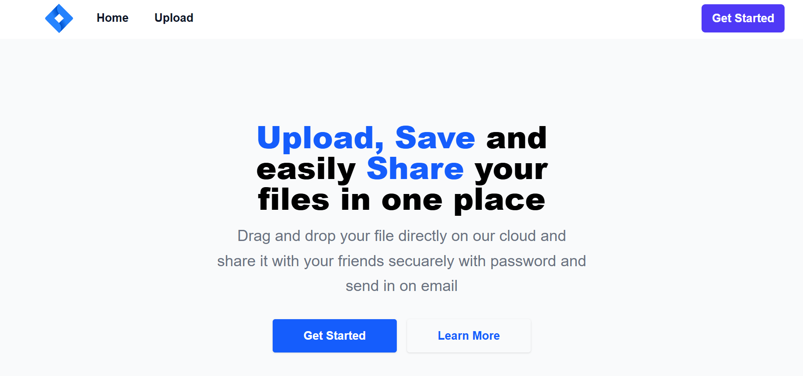
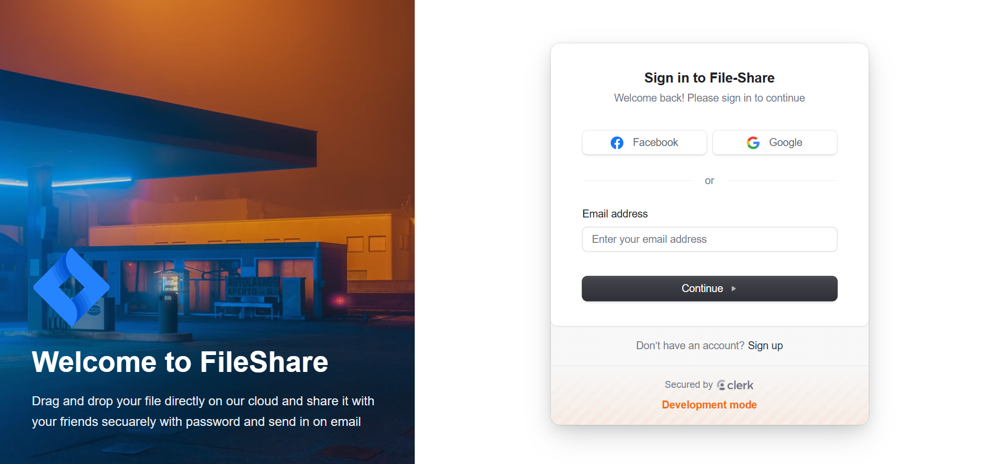
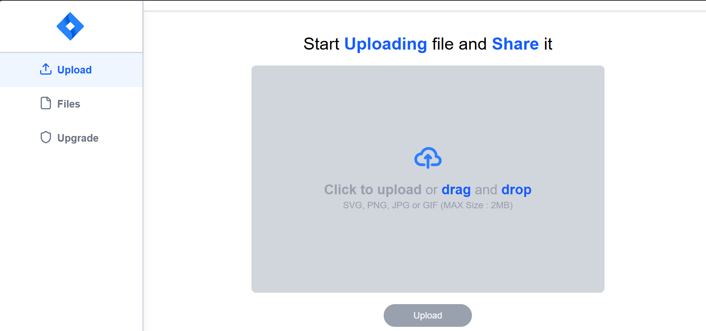
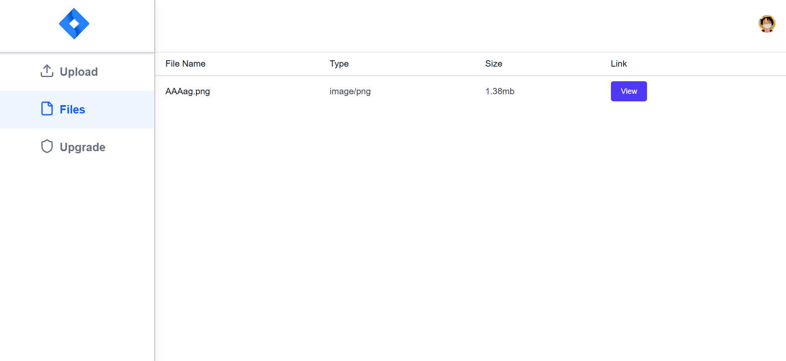
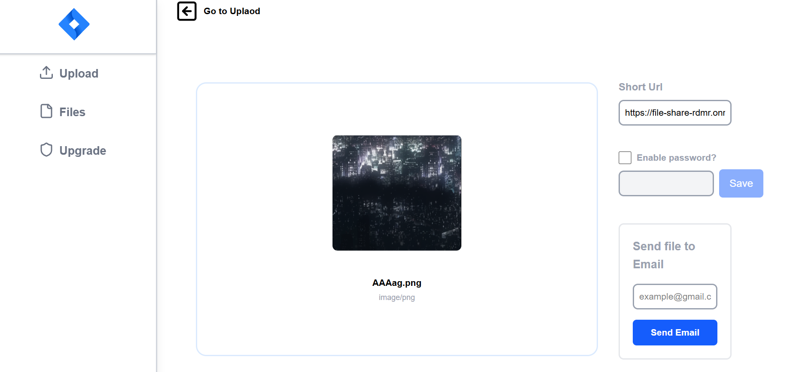
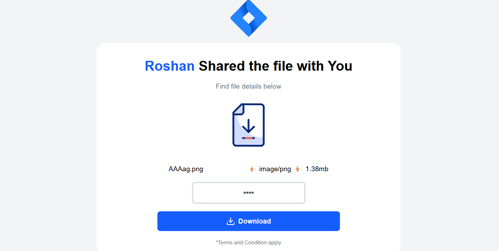

# 📁 File-Share – A Serverless File Sharing SaaS App

**File-Share** is a secure, serverless SaaS web application built using **Next.js**. It allows users to upload images(Only Image), protect them with passwords, and share them easily via email. With powerful tools like **Clerk** for authentication, **Firebase** for data storage, and **Cloudinary** for media storage, this app offers a modern and seamless file-sharing experience without managing any servers.

---

## 🚀 Features

- 🔒 **Secure File Sharing** – Share files via unique download links
- ✉️ **Email Delivery** – Send file access links directly to recipients
- 🛡️ **Password Protection** – Optional password lock on shared files
- ☁️ **Cloud Storage** – Files stored securely in Cloudinary
- 🔐 **Serverless Authentication** – Handled by Clerk
- 📊 **Metadata Storage** – File details and access info stored in Firebase
- 💡 **Fully Serverless Architecture** – No custom backend servers required

---

## 🧑‍💻 Tech Stack

| Purpose            | Technology Used |
| ------------------ | --------------- |
| Frontend & Backend | Next.js         |
| Authentication     | Clerk.dev       |
| Database           | Firebase        |
| File Storage       | Cloudinary      |
| Email Service      | Nodemailer      |
| Deployment         | Render.com      |

---

## 📸 Screenshots

> _(Add screenshots of upload form, password prompt, and success message here)_  
> Example:
>  >  >  >  >  > 

---

## 🔧 How It Works

1. **User Authentication:**

   - Users log in using Clerk.

2. **File Upload:**

   - User uploads a file via a drag-and-drop or input form.
   - File is uploaded to Cloudinary.
   - Metadata (file URL, user info, password protection, timestamps) is stored in Firebase.

3. **Link Generation:**

   - A unique, shareable link is generated.
   - If password protection is enabled, users must enter it to access the file.

4. **Email Sharing:**
   - Users can send the link via email to any recipient directly from the app.

---

## 📂 Project Structure
